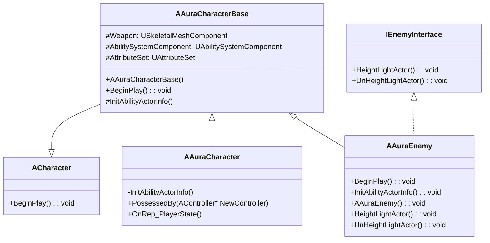
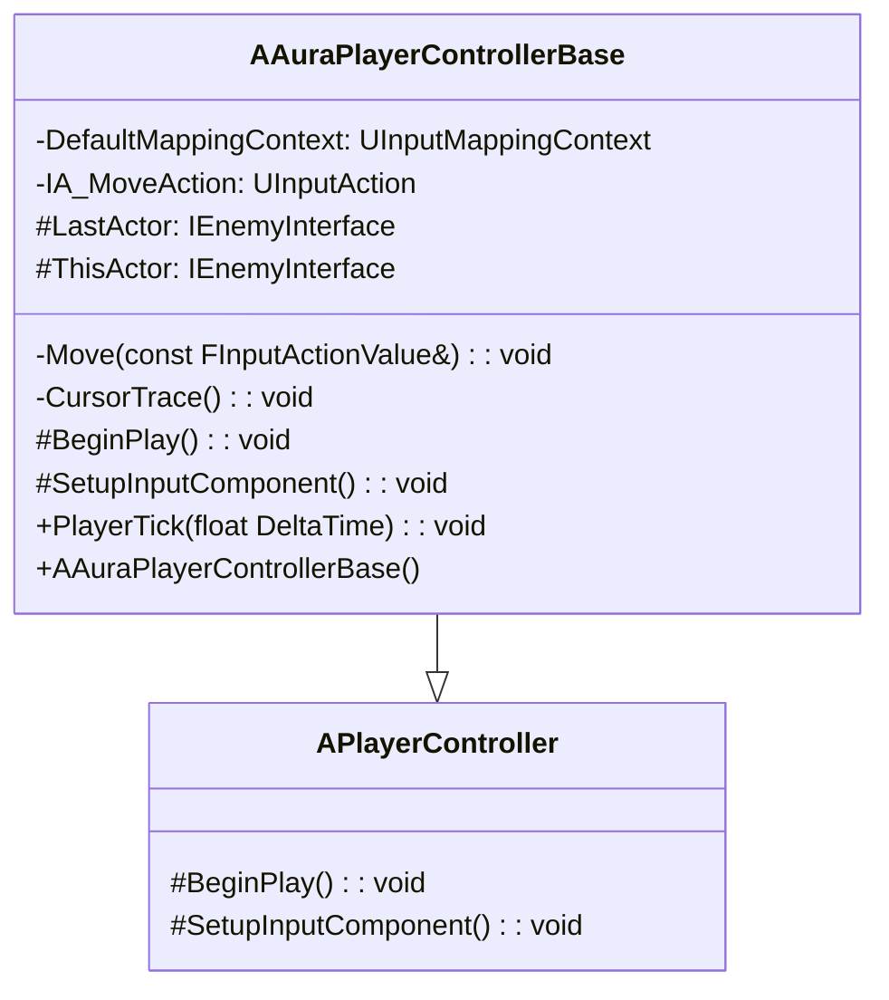
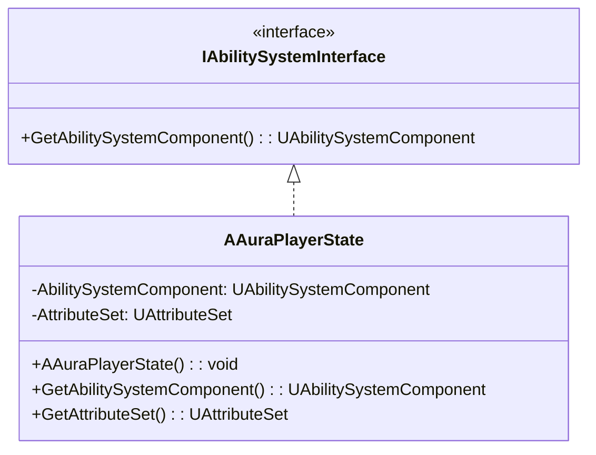
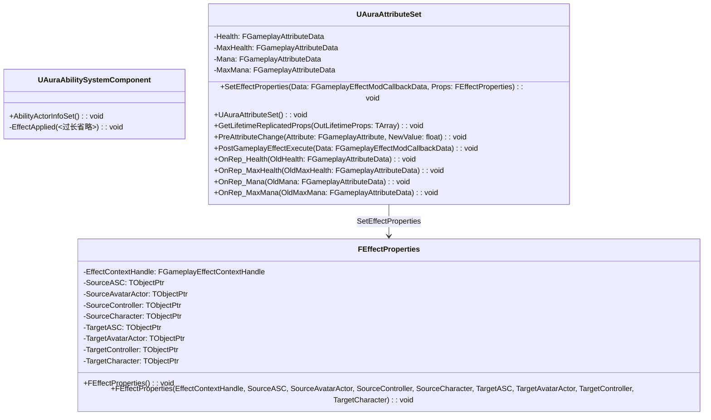
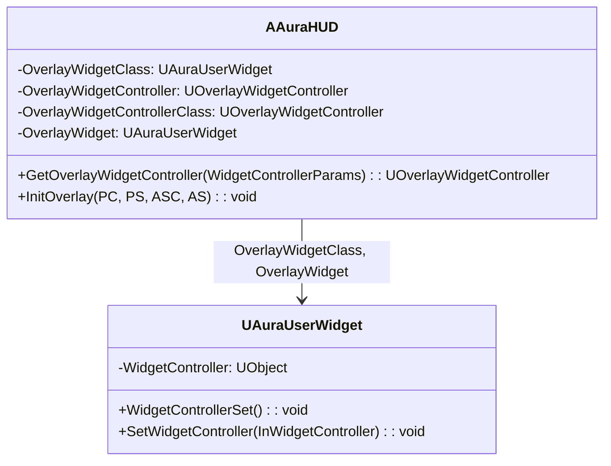

```mermaid
classDiagram

class AAuraCharacterBase{
	#Weapon: USkeletalMeshComponent
	#AbilitySystemComponent: UAbilitySystemComponent
	#AttributeSet: UAttributeSet

	+AAuraCharacterBase()
	+BeginPlay(): void
	#InitAbilityActorInfo()
	
}

class AAuraCharacter{
	-InitAbilityActorInfo()
	+PossessedBy(AController* NewController)
	+OnRep_PlayerState()
}

class IEnemyInterface{
	+HeightLightActor(): void
	+UnHeightLightActor(): void 
}
class AAuraEnemy{
	+BeginPlay(): void
	+InitAbilityActorInfo(): void
	+AAuraEnemy(): void
	+HeightLightActor(): void
	+UnHeightLightActor(): void
}

class ACharacter{
	+BeginPlay(): void 
}

AAuraCharacterBase --|> ACharacter
AAuraCharacterBase <|-- AAuraCharacter

AAuraCharacterBase <|-- AAuraEnemy
IEnemyInterface <|.. AAuraEnemy
```

```mermaid
classDiagram

class AAuraPlayerControllerBase{
	-DefaultMappingContext: UInputMappingContext
	-IA_MoveAction: UInputAction
	-Move(const FInputActionValue&): void
	-CursorTrace(): void

	#BeginPlay(): void
	#SetupInputComponent(): void
	#LastActor: IEnemyInterface
	#ThisActor: IEnemyInterface

	+PlayerTick(float DeltaTime): void
	+AAuraPlayerControllerBase()
}

class APlayerController{
	#BeginPlay(): void
	#SetupInputComponent(): void
}

AAuraPlayerControllerBase --|>APlayerController
```

```mermaid
classDiagram

class IAbilitySystemInterface{
	<<interface>>
	+GetAbilitySystemComponent(): UAbilitySystemComponent
}

class AAuraPlayerState{
	+AAuraPlayerState(): void
	+GetAbilitySystemComponent(): UAbilitySystemComponent
	+GetAttributeSet(): UAttributeSet
	-AbilitySystemComponent: UAbilitySystemComponent
	-AttributeSet: UAttributeSet
}

IAbilitySystemInterface <|.. AAuraPlayerState
```

```mermaid
classDiagram

class UAuraAbilitySystemComponent{
	+AbilityActorInfoSet(): void
	-EffectApplied(~过长省略~): void
}

class UAuraAttributeSet{
	+SetEffectProperties(Data: FGameplayEffectModCallbackData, Props: FEffectProperties): void
	+UAuraAttributeSet(): void
	+GetLifetimeReplicatedProps(OutLifetimeProps: TArray<FLifetimeProperty>): void
	+PreAttributeChange(Attribute: FGameplayAttribute, NewValue: float): void
	+PostGameplayEffectExecute(Data: FGameplayEffectModCallbackData): void
	+OnRep_Health(OldHealth: FGameplayAttributeData): void
	+OnRep_MaxHealth(OldMaxHealth: FGameplayAttributeData): void
	+OnRep_Mana(OldMana: FGameplayAttributeData): void
	+OnRep_MaxMana(OldMaxMana: FGameplayAttributeData): void
	-Health: FGameplayAttributeData
	-MaxHealth: FGameplayAttributeData
	-Mana: FGameplayAttributeData
	-MaxMana: FGameplayAttributeData
}

class FEffectProperties{
	+FEffectProperties(): void
	+FEffectProperties(EffectContextHandle, SourceASC, SourceAvatarActor, SourceController, SourceCharacter, TargetASC, TargetAvatarActor, TargetController, TargetCharacter): void
	-EffectContextHandle: FGameplayEffectContextHandle
	-SourceASC: TObjectPtr<UAbilitySystemComponent>
	-SourceAvatarActor: TObjectPtr<AActor>
	-SourceController: TObjectPtr<AController>
	-SourceCharacter: TObjectPtr<ACharacter>
	-TargetASC: TObjectPtr<UAbilitySystemComponent>
	-TargetAvatarActor: TObjectPtr<AActor>
	-TargetController: TObjectPtr<AController>
	-TargetCharacter: TObjectPtr<ACharacter>
}

UAuraAttributeSet --> FEffectProperties : SetEffectProperties

```

```mermaid
classDiagram

class AAuraHUD{
	+GetOverlayWidgetController(WidgetControllerParams): UOverlayWidgetController
	+InitOverlay(PC, PS, ASC, AS): void
	-OverlayWidgetClass: UAuraUserWidget
	-OverlayWidgetController: UOverlayWidgetController
	-OverlayWidgetControllerClass: UOverlayWidgetController
	-OverlayWidget: UAuraUserWidget
}

class UAuraUserWidget{
	+WidgetControllerSet(): void
	+SetWidgetController(InWidgetController): void
	-WidgetController: UObject
}

AAuraHUD --> UAuraUserWidget : OverlayWidgetClass, OverlayWidget
```
![[Untitled diagram-2024-06-04-015301 1.svg]]