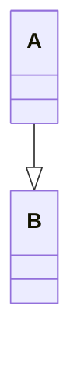
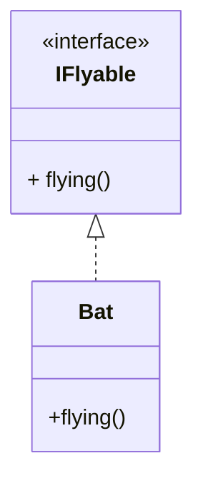
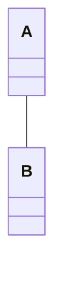
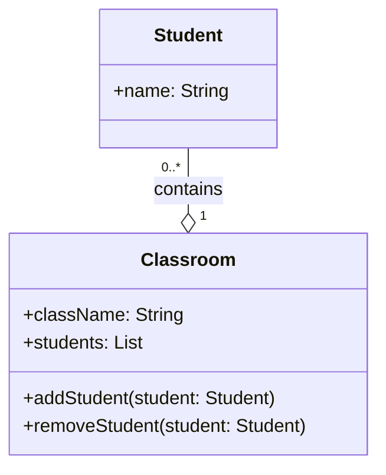
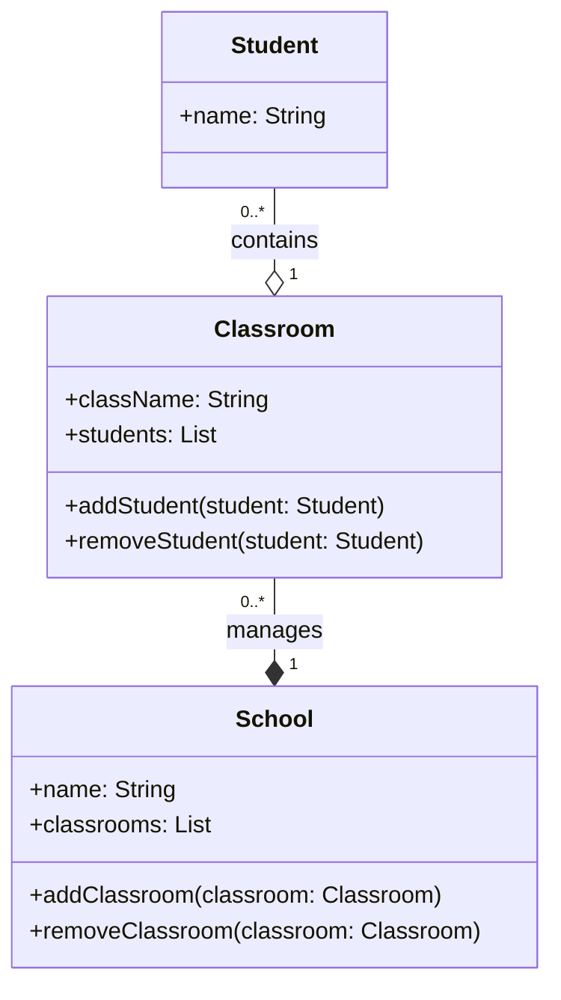
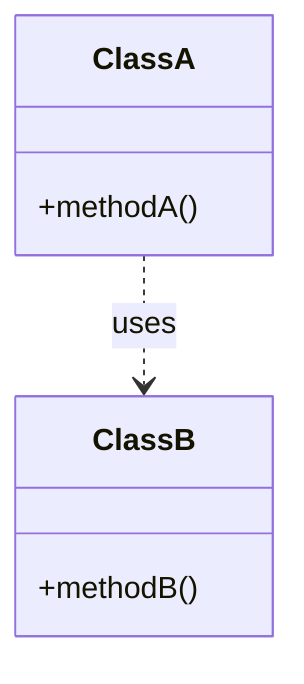

## visibility:
- `-`: private
- `+`: public
- `#`: protected
- `~`: package/default

| 类名  | Class                                                    |
| :-: | :------------------------------------------------------- |
| 属性  | -Attribute: type -Attribute: type -Attribute: type |
| 方法  | -Method()                                                |

抽象类使用 ***斜体*** 或者使用`<< >>`包裹
___
## 关系

### Inheritance:

### Realization

### Association:

### Aggregation:

### Composition:

### Dependency:

## Multiplicity
	0..1: zero to one (optional)
	n: specific number
	0..\*: zero to many
	1..\*: one to many
	m..n: specific number range

## 接口
与类图的区别主要是顶端有`《interface》`显示。第一行是接口名称，第二行是接口方法。
接口还有另种表示方法，俗称棒棒糖表示法。
